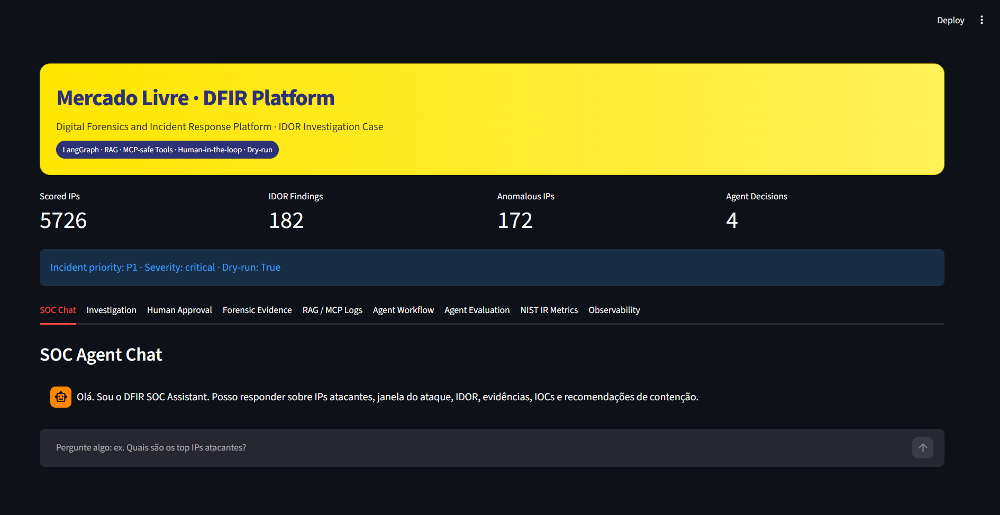

# IDOR Response Platform

<p align="center">
  <strong>IDOR Response Platform</strong><br/>
  Digital Forensics & Incident Response · GenAI Agents · Human-in-the-loop · NIST IR · SOC Observability
</p>

<p align="center">
  
  
  
  
  
  
</p>

---

## Digital Forensics & Incident Response Platform

Technical Challenge — Technical Leader, Digital Forensics and Incident Response
Mercado Livre / Mercado Libre Cybersecurity Case

---

## Overview

The **IDOR Response Platform** is an end-to-end Digital Forensics and Incident Response platform designed to investigate, explain, validate and safely respond to **IDOR — Insecure Direct Object Reference** incidents.

The project was built as a complete DFIR/SOC investigation platform, combining:

* Forensic ingestion
* Chain of custody
* URI parsing
* Feature engineering
* IDOR detection
* Risk scoring
* Anomaly detection
* IOC generation
* Forensic evidence packaging
* LangGraph multi-agent orchestration
* Human-in-the-loop approval
* Dry-run containment simulation
* RAG-based SOC Copilot
* MCP-safe tool execution
* NIST incident response metrics
* Observability and SOC monitoring
* Automated reporting

All containment actions are executed in **dry-run mode**, ensuring safety, auditability and human oversight.

---

## Challenge Requirements Coverage

| Challenge Requirement        | Platform Capability                    | Status |
| ---------------------------- | -------------------------------------- | ------ |
| Incident classification      | Triage Agent                           | ✅      |
| Severity classification      | Risk scoring + Triage Agent            | ✅      |
| Hypothesis generation        | Triage Agent                           | ✅      |
| Investigation prioritization | Risk score + anomaly convergence       | ✅      |
| Forensic analysis            | Forensic Analyst Agent                 | ✅      |
| Patient zero identification  | Forensic evidence package              | ✅      |
| Initial exploitation window  | Attack timeline                        | ✅      |
| Automation assessment        | Bot/anomaly/sequential access analysis | ✅      |
| MITRE ATT&CK mapping         | Forensic Analyst Agent                 | ✅      |
| Immediate containment        | Response Advisor Agent                 | ✅      |
| Strategic containment        | NIST IR layer                          | ✅      |
| Human approval               | Human Approval Agent                   | ✅      |
| Dry-run execution            | Safe simulated tools                   | ✅      |
| Decision logging             | Agent decision log                     | ✅      |
| Workflow state machine       | LangGraph workflow                     | ✅      |
| Workflow re-entry            | Request more evidence scenario         | ✅      |
| Response metrics             | TTD / TTR / TTC                        | ✅      |
| Dashboards / metrics         | Streamlit + observability artifacts    | ✅      |
| Final reports                | Technical report + executive summary   | ✅      |

---

## High-Level Architecture

```text
Raw Web Logs
    │
    ▼
Evidence Integrity / Chain of Custody
    │
    ▼
URI Parsing
    │
    ▼
Feature Engineering
    │
    ▼
IDOR Detection
    │
    ▼
Risk Scoring
    │
    ▼
Anomaly Detection
    │
    ▼
Forensic Evidence Package
    │
    ▼
LangGraph Investigation Agents
    │
    ├── Triage Agent
    ├── Forensic Analyst Agent
    ├── Response Advisor Agent
    └── Human Approval Agent
    │
    ▼
Human-in-the-loop Workflow
    │
    ▼
NIST Incident Response Metrics
    │
    ▼
Observability & SOC Monitoring
    │
    ▼
SOC Copilot / Streamlit UI
    │
    ▼
Technical Reports & Executive Summary
```

---

## Technology Stack

| Layer                  | Technology                          |
| ---------------------- | ----------------------------------- |
| Language               | Python 3.12                         |
| Data processing        | Polars                              |
| Storage format         | Parquet                             |
| Validation             | Pydantic v2                         |
| ML / anomaly detection | Scikit-learn / Isolation Forest     |
| Agent orchestration    | LangGraph                           |
| LLM interface          | OpenAI-compatible API via LangChain |
| UI                     | Streamlit                           |
| Testing                | Pytest                              |
| Reporting              | Markdown + Matplotlib figures       |
| Evidence format        | JSON                                |
| Workflow visualization | Mermaid / PNG                       |

---

## Dataset

Input file:

```text
data/raw/three_months.csv
```

Observed dataset size:

| Metric         |     Value |
| -------------- | --------: |
| Raw events     | 4,478,619 |
| Columns        |         8 |
| Analyzed IPs   |     5,726 |
| IDOR findings  |       182 |
| Anomalous IPs  |       172 |
| Generated IOCs |       586 |

---

## Input Schema

| Original Column   | Normalized Column |
| ----------------- | ----------------- |
| `timestamp`       | `timestamp`       |
| `http_staus`      | `status_code`     |
| `http_host`       | `host`            |
| `http_uri`        | `uri`             |
| `http_method`     | `method`          |
| `http_referer`    | `referer`         |
| `http_user_agent` | `user_agent`      |
| `source_ip`       | `source_ip`       |

Extracted URI fields:

| Field        | Description                                               |
| ------------ | --------------------------------------------------------- |
| `invoice_id` | Direct object identifier used for invoice access analysis |
| `site_id`    | Site/country/business context identifier                  |
| `auth_token` | Token-like value observed in request URI                  |

---

## Project Structure

```text
src/
├── agents/
│   ├── conversation_agent.py
│   ├── conversation_memory.py
│   ├── export_graph.py
│   ├── forensic_agent.py
│   ├── graph.py
│   ├── human_approval_agent.py
│   ├── human_decision_simulator.py
│   ├── interactive_console.py
│   ├── llm_client.py
│   ├── response_agent.py
│   ├── response_formatter.py
│   ├── runner.py
│   ├── soc_assistant.py
│   ├── state.py
│   ├── triage_agent.py
│   └── workflow.py
│
├── config/
│   ├── llm_settings.py
│   └── settings.py
│
├── detection/
│   ├── anomaly_detector.py
│   ├── bot_detector.py
│   ├── idor_detector.py
│   ├── isolation_forest.py
│   └── risk_scoring.py
│
├── evaluation/
│   ├── agent_evaluator.py
│   ├── evaluation_report.py
│   ├── question_bank.py
│   └── scoring.py
│
├── forensic/
│   ├── evidence_builder.py
│   ├── ioc_generator.py
│   └── timeline.py
│
├── ingestion/
│   ├── integrity.py
│   └── loader.py
│
├── ir/
│   ├── containment_strategy.py
│   ├── nist_lifecycle.py
│   ├── response_metrics.py
│   ├── root_cause_analysis.py
│   └── runner.py
│
├── mcp_gateway/
│   └── safe_tools.py
│
├── memory/
│   └── investigation_memory.py
│
├── models/
│   ├── events.py
│   └── features.py
│
├── observability/
│   ├── agent_metrics.py
│   ├── healthcheck.py
│   ├── platform_metrics.py
│   ├── runner.py
│   └── soc_dashboard_data.py
│
├── parsing/
│   └── uri_parser.py
│
├── rag/
│   ├── local_retriever.py
│   └── knowledge_base.py
│
├── reporting/
│   ├── figures.py
│   ├── markdown_builder.py
│   ├── pdf_exporter.py
│   ├── report_data_loader.py
│   └── runner.py
│
├── response/
│   └── playbook.py
│
├── tools/
│   └── response_tools.py
│
├── ui/
│   └── streamlit_app.py
│
├── utils/
│   └── filesystem.py
│
└── app.py

data/
├── raw/
├── processed/
├── evidence/
├── evaluation/
├── observability/
├── memory/
└── knowledge/

reports/
├── technical_report.md
├── executive_summary.md
├── architecture.md
├── methodology.md
├── evidence_appendix.md
└── figures/
    ├── agent_coverage.png
    ├── agent_metrics.png
    ├── pipeline_metrics.png
    └── streamlit_ui.png

tests/
├── test_agent_evaluation.py
├── test_agents.py
├── test_anomaly_detection.py
├── test_conversation_agent.py
├── test_detection.py
├── test_forensic.py
├── test_human_approval.py
├── test_human_orchestration.py
├── test_integrity.py
├── test_nist_ir.py
├── test_observability.py
├── test_reporting.py
└── test_uri_parser.py
```

---


# Reproducibility Guide

This section is the single source of truth for setup, installation, environment configuration, dataset requirements, compilation, pipeline execution, automated tests, integration validation, human approval scenarios, SOC Copilot modes, Streamlit UI validation, smoke tests, release validation and local Git cleanup.

It is intentionally detailed so that a technical reviewer can reproduce the Release 1.0 delivery from a clean clone while also having the option to run the same workflow through reproducibility scripts.

---

## Validation Assumptions

The official submitted version is frozen in the Git tag:

```text
v1.0.0
```

The expected Release 1.0 commit is:

```text
35c26e1 feat(sprint-4.0): generate final delivery package and presentation assets
```

The full pipeline requires the original challenge dataset at:

```text
data/raw/three_months.csv
```

This raw file is intentionally not versioned in Git because it is large and should be treated as raw input evidence.

In a clean clone, the recommended execution order is:

```text
clone repository
↓
create virtual environment
↓
install dependencies
↓
configure .env
↓
place data/raw/three_months.csv
↓
compile critical modules
↓
run pipeline
↓
run pytest
↓
validate artifacts
↓
validate metrics
↓
validate Streamlit UI
```

The pipeline should be executed before the full test suite in a clean clone because some integration tests validate artifacts generated in:

```text
data/evidence/
data/evaluation/
data/observability/
```

---

# Option A — Guided Manual Setup

Use this option when the reviewer wants to execute the validation flow command by command and inspect every stage of the platform.

---

## Block 1 — Clean Release Clone

```bash
cd ~/OneDrive/Documentos

rm -rf idor-clean-test

git clone -b master https://github.com/mauriciosobrinho/digital_forensics_and_incident_response.git idor-clean-test

cd idor-clean-test

git branch --show-current
```

Expected:

```text
master
```

```bash
git log --oneline -1
```

Expected:

```text
35c26e1 feat(sprint-4.0): generate final delivery package and presentation assets
```

```bash
git tag --list
```

Expected:

```text
v1.0.0
```

Optional:

```bash
git checkout v1.0.0
git checkout master
```

---

## Block 2 — Validate Project Structure

```bash
ls -lah

ls -lah src data reports presentation demo scripts
```

Expected:

```text
src/
data/
reports/
presentation/
demo/
scripts/
requirements.txt
README.md
```

---

## Block 3 — Create and Activate Virtual Environment

```bash
python -m venv .venv

source .venv/Scripts/activate

which python

python --version
```

Expected:

```text
Python 3.12.x
```

Windows CMD:

```bat
.venv\Scripts\activate
```

Linux/macOS:

```bash
source .venv/bin/activate
```

---

## Block 4 — Install Dependencies

```bash
python -m pip install --upgrade pip

pip install -r requirements.txt
```

---

## Block 5 — Configure Deterministic Environment

```bash
cat > .env <<'EOF'
AGENTS_USE_LLM=false
AGENTS_DRY_RUN=true
HUMAN_APPROVAL_MODE=simulated
HUMAN_DECISION_SCENARIO=approve
LANGGRAPH_CHECKPOINT_BACKEND=memory
EOF
```

Validate:

```bash
cat .env
```

Expected:

```env
AGENTS_USE_LLM=false
AGENTS_DRY_RUN=true
HUMAN_APPROVAL_MODE=simulated
HUMAN_DECISION_SCENARIO=approve
LANGGRAPH_CHECKPOINT_BACKEND=memory
```

Purpose:

- reproducible testing
- CI/CD validation
- offline execution
- challenge validation
- no external dependencies
- no API cost

---

## Block 6 — Required Dataset

Create raw directory:

```bash
mkdir -p data/raw
```

Copy dataset:

```bash
cp /path/to/three_months.csv data/raw/three_months.csv
```

Validate:

```bash
ls -lah data/raw/three_months.csv
```

Expected:

```text
data/raw/three_months.csv
```

If the file is missing the platform will intentionally fail during chain-of-custody generation because SHA-256 integrity validation is mandatory.

---

## Block 7 — Compile Critical Modules

```bash
python -m py_compile src/app.py

python -m py_compile src/ui/streamlit_app.py

python -m py_compile src/reporting/pdf_exporter.py

python -m py_compile scripts/generate_final_delivery_package.py

python -m py_compile src/agents/evidence_router.py

python -m py_compile src/agents/evidence_answer_templates.py

python -m py_compile src/agents/evidence_grounded_copilot.py

python -m py_compile src/agents/conversation_agent.py
```

Expected:

```text
Return to prompt without errors.
```

---

## Block 8 — Run Full Pipeline

```bash
python -m src.app
```

Expected:

```text
Pipeline completed successfully.
Agent evaluation coverage : 100.0%
SOC observability health : healthy
```

Windows may show non-blocking WeasyPrint warnings.

---

## Block 9 — Run Full Test Suite

Keep:

```env
HUMAN_DECISION_SCENARIO=approve
```

Run:

```bash
pytest -v
```

Expected after Sprint 4.1:

```text
46 passed
```

---

## Block 10 — Validate Generated Artifacts

```bash
ls -lah data/evidence

ls -lah data/evaluation

ls -lah data/observability

ls -lah reports

ls -lah presentation

ls -lah demo/outputs
```

---

## Block 11 — Validate Core Metrics

```bash
python -c "import json;d=json.load(open('data/observability/platform_metrics.json',encoding='utf-8'));print(json.dumps(d['pipeline_metrics'],indent=2,ensure_ascii=False))"
```

```bash
python -c "import json;d=json.load(open('data/observability/soc_dashboard_data.json',encoding='utf-8'));print(json.dumps(d['topline'],indent=2,ensure_ascii=False))"
```

```bash
python -c "import json;d=json.load(open('data/evaluation/agent_eval_report.json',encoding='utf-8'));print(json.dumps(d['summary'],indent=2,ensure_ascii=False))"
```

Expected:

```text
4,478,619 logs
5,726 IPs
182 findings
172 anomalous IPs
586 IOCs
100% agent evaluation coverage
healthy SOC observability
```

---

## Block 12 — Human Approval Scenarios

### approve

```bash
python -m src.app
```

Expected:

```text
human_loop_count = 0
decision_log = 4
```

### reject

Set:

```env
HUMAN_DECISION_SCENARIO=reject
```

Run:

```bash
python -m src.app
```

Expected:

```text
workflow_stage = rejected
decision_log = 4
```

### modify

Set:

```env
HUMAN_DECISION_SCENARIO=modify
```

Run:

```bash
python -m src.app
```

Expected:

```text
modified_action_plan != {}
decision_log = 4
```

### request_more_evidence

Set:

```env
HUMAN_DECISION_SCENARIO=request_more_evidence
```

Run:

```bash
python -m src.app
```

Expected:

```text
human_loop_count = 1
decision_log = 7
```

---

## Block 13 — Restore Default Environment

```bash
cat > .env <<'EOF'
AGENTS_USE_LLM=false
AGENTS_DRY_RUN=true
HUMAN_APPROVAL_MODE=simulated
HUMAN_DECISION_SCENARIO=approve
LANGGRAPH_CHECKPOINT_BACKEND=memory
EOF
```

---

## Block 14 — Re-run Tests

```bash
pytest -v
```

Expected:

```text
46 passed
```

---

## SOC Copilot Modes

The SOC Copilot supports two different validation modes.

### Mode A — Deterministic Mode

Configuration:

```env
AGENTS_USE_LLM=false
HUMAN_DECISION_SCENARIO=approve
```

Use this mode for:

* reproducible testing
* CI/CD
* challenge validation
* offline execution
* no external dependency
* no API cost

Expected behavior:

```text
Question
 ↓
RAG lookup
 ↓
Template response
 ↓
Deterministic output
```

In this mode, responses may look more template-based because the LLM is disabled. That is expected and correct.

### Mode B — LLM-Assisted Mode

Configuration:

```env
AGENTS_USE_LLM=true
HUMAN_DECISION_SCENARIO=approve
```

Additional provider-specific configuration is required. Example with Groq:

```env
AGENTS_USE_LLM=true
AGENTS_DRY_RUN=true
HUMAN_APPROVAL_MODE=simulated
HUMAN_DECISION_SCENARIO=approve
LANGGRAPH_CHECKPOINT_BACKEND=memory

LLM_PROVIDER=groq
LLM_API_KEY=gsk_...
LLM_MODEL=llama-3.3-70b-versatile
LLM_BASE_URL=https://api.groq.com/openai/v1
```

Use this mode for:

* analyst copilot experience
* richer explanations
* natural language reasoning
* executive demonstrations
* technical walkthroughs

Expected behavior:

```text
Question
 ↓
RAG lookup
 ↓
Relevant context
 ↓
LLM reasoning
 ↓
Natural-language analyst response
```

Recommended executive demonstration sequence:

1. Start with deterministic mode to show that the platform works without external dependencies.
2. Switch to LLM-assisted mode.
3. Ask the same investigation questions again.
4. Demonstrate the difference between deterministic output and natural-language SOC analyst reasoning.

---

## Block 18A — Streamlit UI Validation in Deterministic Mode

Restore deterministic configuration:

```bash
cat > .env <<'EOF'
AGENTS_USE_LLM=false
AGENTS_DRY_RUN=true
HUMAN_APPROVAL_MODE=simulated
HUMAN_DECISION_SCENARIO=approve
LANGGRAPH_CHECKPOINT_BACKEND=memory
EOF
```

Run the UI:

```bash
streamlit run src/ui/streamlit_app.py
```

Open:

```text
http://localhost:8501
```

Suggested SOC Chat questions:

```text
Who is the patient zero?
Was the attack automated?
What containment is recommended?
What evidence supports IDOR exploitation?
What are the TTD TTR TTC metrics?
```

Expected: the UI should answer using deterministic retrieval/template behavior.

---

## Block 18B — Streamlit UI Validation in LLM-Assisted Mode

Configure LLM mode:

```bash
cat > .env <<'EOF'
AGENTS_USE_LLM=true
AGENTS_DRY_RUN=true
HUMAN_APPROVAL_MODE=simulated
HUMAN_DECISION_SCENARIO=approve
LANGGRAPH_CHECKPOINT_BACKEND=memory

LLM_PROVIDER=groq
LLM_API_KEY=gsk_...
LLM_MODEL=llama-3.3-70b-versatile
LLM_BASE_URL=https://api.groq.com/openai/v1
EOF
```

Run the UI:

```bash
streamlit run src/ui/streamlit_app.py
```

Open:

```text
http://localhost:8501
```

Suggested SOC Chat questions:

```text
Who is the patient zero?
Was the attack automated?
What containment is recommended?
What evidence supports IDOR exploitation?
What is the business impact?
```

Expected: the UI should provide richer natural-language responses using the configured LLM provider.

---

## Block 19 — Streamlit Smoke Test

Validate the following tabs:

```text
SOC Chat
Investigation
Human Approval
Forensic Evidence
RAG / MCP Logs
Agent Workflow
Agent Evaluation
NIST IR Metrics
Observability
```

Expected: all tabs should load without runtime errors after the pipeline has generated the required artifacts.

---

## Block 20 — Git Workspace Cleanup After Local Validation

Running the pipeline and UI may regenerate local artifacts. This is expected.

Check repository state:

```bash
git status
```

Restore tracked generated artifacts if needed:

```bash
git restore data/evaluation data/observability data/memory reports/technical_report.md reports/figures/agent_metrics.png
```

Remove optional non-generated PDF marker files if present:

```bash
rm -f reports/technical_report.pdf.not_generated.txt reports/executive_summary.pdf.not_generated.txt
```

Validate clean workspace:

```bash
git status
```

Expected:

```text
nothing to commit, working tree clean
```

---

## LLM Provider Examples

The platform uses an OpenAI-compatible client interface for most providers. In most cases, change only:

```env
LLM_PROVIDER
LLM_MODEL
LLM_API_KEY
LLM_BASE_URL
```

### Groq OpenAI-compatible API key and settings

```env
AGENTS_USE_LLM=true

LLM_PROVIDER=groq
LLM_API_KEY=gsk_...
LLM_MODEL=llama-3.3-70b-versatile
LLM_BASE_URL=https://api.groq.com/openai/v1
```

### OpenAI API key and settings

```env
AGENTS_USE_LLM=true

LLM_PROVIDER=openai
LLM_API_KEY=sk-proj-...
LLM_MODEL=gpt-4.1-mini
LLM_BASE_URL=
```

### OpenRouter API key and settings

```env
AGENTS_USE_LLM=true

LLM_PROVIDER=openrouter
LLM_API_KEY=sk-or-...
LLM_MODEL=openai/gpt-4.1-mini
LLM_BASE_URL=https://openrouter.ai/api/v1
```

### Anthropic Claude Sonnet via OpenRouter

```env
AGENTS_USE_LLM=true

LLM_PROVIDER=openrouter
LLM_API_KEY=sk-or-...
LLM_MODEL=anthropic/claude-3.5-sonnet
LLM_BASE_URL=https://openrouter.ai/api/v1
```

### Anthropic Claude Haiku via OpenRouter

```env
AGENTS_USE_LLM=true

LLM_PROVIDER=openrouter
LLM_API_KEY=sk-or-...
LLM_MODEL=anthropic/claude-3.5-haiku
LLM_BASE_URL=https://openrouter.ai/api/v1
```

### Anthropic Claude Opus via OpenRouter

```env
AGENTS_USE_LLM=true

LLM_PROVIDER=openrouter
LLM_API_KEY=sk-or-...
LLM_MODEL=anthropic/claude-3-opus
LLM_BASE_URL=https://openrouter.ai/api/v1
```

### Google Gemini native OpenAI-compatible endpoint

```env
AGENTS_USE_LLM=true

LLM_PROVIDER=gemini
LLM_API_KEY=your_gemini_key
LLM_MODEL=gemini-2.5-flash
LLM_BASE_URL=https://generativelanguage.googleapis.com/v1beta/openai/
```

### Google Gemini via OpenRouter

```env
AGENTS_USE_LLM=true

LLM_PROVIDER=openrouter
LLM_API_KEY=sk-or-...
LLM_MODEL=google/gemini-2.5-flash
LLM_BASE_URL=https://openrouter.ai/api/v1
```

### Perplexity OpenAI-compatible API key and settings

```env
AGENTS_USE_LLM=true

LLM_PROVIDER=perplexity
LLM_API_KEY=pplx-...
LLM_MODEL=sonar-pro
LLM_BASE_URL=https://api.perplexity.ai
```

### Perplexity Sonar Reasoning

```env
AGENTS_USE_LLM=true

LLM_PROVIDER=perplexity
LLM_API_KEY=pplx-...
LLM_MODEL=sonar-reasoning-pro
LLM_BASE_URL=https://api.perplexity.ai
```

### xAI Grok

```env
AGENTS_USE_LLM=true

LLM_PROVIDER=xai
LLM_API_KEY=xai-...
LLM_MODEL=grok-3
LLM_BASE_URL=https://api.x.ai/v1
```

### xAI Grok Mini

```env
AGENTS_USE_LLM=true

LLM_PROVIDER=xai
LLM_API_KEY=xai-...
LLM_MODEL=grok-3-mini
LLM_BASE_URL=https://api.x.ai/v1
```

### Local OpenAI-compatible server

Example for local gateways such as LM Studio, Ollama-compatible proxies, LiteLLM, vLLM or local OpenAI-compatible endpoints:

```env
AGENTS_USE_LLM=true

LLM_PROVIDER=local
LLM_API_KEY=local_or_dummy_key
LLM_MODEL=local-model-name
LLM_BASE_URL=http://localhost:1234/v1
```

### Quick provider switching examples

#### OpenRouter + GPT-4.1 Mini

```env
LLM_PROVIDER=openrouter
LLM_API_KEY=sk-or-...
LLM_MODEL=openai/gpt-4.1-mini
LLM_BASE_URL=https://openrouter.ai/api/v1
```

#### OpenRouter + Claude Sonnet

```env
LLM_PROVIDER=openrouter
LLM_API_KEY=sk-or-...
LLM_MODEL=anthropic/claude-3.5-sonnet
LLM_BASE_URL=https://openrouter.ai/api/v1
```

#### OpenRouter + Gemini Flash

```env
LLM_PROVIDER=openrouter
LLM_API_KEY=sk-or-...
LLM_MODEL=google/gemini-2.5-flash
LLM_BASE_URL=https://openrouter.ai/api/v1
```

#### Groq + Llama 3.3 70B

```env
LLM_PROVIDER=groq
LLM_API_KEY=gsk_...
LLM_MODEL=llama-3.3-70b-versatile
LLM_BASE_URL=https://api.groq.com/openai/v1
```

#### Perplexity Sonar Pro

```env
LLM_PROVIDER=perplexity
LLM_API_KEY=pplx-...
LLM_MODEL=sonar-pro
LLM_BASE_URL=https://api.perplexity.ai
```

### Native Claude/Gemini note

For native Claude/Gemini SDKs, the SDK and client implementation may change. If using Claude or Gemini via OpenRouter, the existing OpenAI-compatible code path can be preserved and only the model changes:

```env
LLM_PROVIDER=openrouter
LLM_API_KEY=sk-or-...
LLM_MODEL=anthropic/claude-3.5-sonnet
LLM_BASE_URL=https://openrouter.ai/api/v1
```

or:

```env
LLM_PROVIDER=openrouter
LLM_API_KEY=sk-or-...
LLM_MODEL=google/gemini-2.5-flash
LLM_BASE_URL=https://openrouter.ai/api/v1
```

---

## Running the Full Pipeline

```bash
python -m src.app
```

The pipeline generates:

* processed Parquet datasets
* forensic evidence
* agent investigation outputs
* human approval artifacts
* LangGraph workflow visualization
* evaluation reports
* NIST incident response metrics
* observability artifacts
* final technical reports

---

## Validation Commands

### Compile critical files

```bash
python -m py_compile src/app.py
python -m py_compile src/ui/streamlit_app.py
```

### Run tests

```bash
pytest -v
```

### Run pipeline

```bash
python -m src.app
```

### Run Streamlit UI

```bash
streamlit run src/ui/streamlit_app.py
```

---

## SOC Copilot Consoles

### Analyst console

Natural language interface for investigation:

```bash
python -m src.agents.interactive_console
```

Example questions:

```text
Quais são os top IPs atacantes?
Qual foi a janela do ataque?
Explique IDOR e Broken Access Control.
O ataque apresenta automação?
Quem é o patient zero?
Quais ações de contenção são recomendadas?
Qual foi o resultado da intervenção humana?
Mostre a timeline do workflow.
Houve reentrada no agente forense?
Quais são as métricas TTD, TTR e TTC?
```

### Debug console

Shows raw JSON payloads for inspection:

```bash
python -m src.agents.interactive_console --json
```

Use this mode to validate:

* selected intent
* tool result
* RAG context
* raw structured payload
* generated answer
* evidence references

---

## Block 17 — Git Cleanup

```bash
git status

git restore data/evaluation data/observability data/memory reports/technical_report.md reports/figures/agent_metrics.png

rm -f reports/technical_report.pdf.not_generated.txt

rm -f reports/executive_summary.pdf.not_generated.txt

git status
```

Expected:

```text
nothing to commit, working tree clean
```

---

# Option B — Scripted Setup

Use this option when the reviewer wants a one-command reproducible validation workflow.

---

## Script Inventory

```text
scripts/
├── setup_env.sh
├── setup_env.bat
├── validate_static.sh
├── validate_static.bat
├── run_pipeline.sh
├── run_pipeline.bat
├── run_tests.sh
├── run_tests.bat
├── run_ui.sh
├── run_ui.bat
├── set_env_deterministic.sh
├── set_env_deterministic.bat
├── set_env_llm_example.sh
├── set_env_llm_example.bat
├── validate_release.sh
└── validate_release.bat
```

---

## Script Responsibilities

| Script | Purpose |
|----------|----------|
| setup_env | Create venv and install dependencies |
| set_env_deterministic | Create deterministic .env |
| set_env_llm_example | Generate LLM example configuration |
| validate_static | Compile critical modules |
| run_pipeline | Execute full pipeline |
| run_tests | Execute pytest suite |
| run_ui | Launch Streamlit UI |
| validate_release | Execute deterministic end-to-end validation |

---

## Fastest Release Validation (Recommended)

Git Bash / Linux / macOS:

```bash
chmod +x scripts/*.sh

scripts/validate_release.sh
```

Windows CMD:

```bat
scripts\validate_release.bat
```

This executes:

```text
set_env_deterministic
↓
validate_static
↓
run_pipeline
↓
run_tests
```

Expected:

```text
46 passed
Release validation completed successfully.
```

---

## Scripted Execution — Step By Step

Git Bash:

```bash
chmod +x scripts/*.sh

scripts/setup_env.sh

source .venv/Scripts/activate

scripts/set_env_deterministic.sh

scripts/validate_static.sh

scripts/run_pipeline.sh

scripts/run_tests.sh

scripts/run_ui.sh
```

Windows CMD:

```bat
scripts\setup_env.bat

.venv\Scripts\activate

scripts\set_env_deterministic.bat

scripts\validate_static.bat

scripts\run_pipeline.bat

scripts\run_tests.bat

scripts\run_ui.bat
```

---

## LLM Example Configuration

Generate:

Git Bash:

```bash
scripts/set_env_llm_example.sh
```

Windows CMD:

```bat
scripts\set_env_llm_example.bat
```

Creates:

```text
.env.example.llm
```

The file never overwrites `.env`.

Replace:

```env
LLM_API_KEY=replace_me
```

with a valid provider key.

---

## Sprint 4.1 Acceptance Criteria

Git Bash:

```bash
scripts/set_env_deterministic.sh

scripts/validate_static.sh

scripts/run_pipeline.sh

scripts/run_tests.sh
```

Windows CMD:

```bat
scripts\set_env_deterministic.bat

scripts\validate_static.bat

scripts\run_pipeline.bat

scripts\run_tests.bat
```

Expected:

```text
46 passed
```

---

## Streamlit UI



Launch:

```bash
streamlit run src/ui/streamlit_app.py
```

### Available Tabs

| Tab                 | Purpose                      | What to Expect                                                    |
| ------------------- | ---------------------------- | ----------------------------------------------------------------- |
| `SOC Chat`          | Natural language SOC Copilot | Ask investigation questions in Portuguese or English              |
| `Investigation`     | Agent investigation output   | Triage, forensic analysis and response advisor JSON               |
| `Human Approval`    | Human-in-the-loop governance | Approval request, approval decision and dry-run status            |
| `Forensic Evidence` | Evidence package             | Chain of custody, summary, attack indicators and forensic context |
| `RAG / MCP Logs`    | Retrieval and safe tool logs | RAG context and MCP-safe tool execution history                   |
| `Agent Workflow`    | LangGraph execution trace    | Workflow timeline, current state and decision transitions         |
| `Agent Evaluation`  | Validation suite             | Overall coverage, passed/partial/failed checks and question bank  |
| `NIST IR Metrics`   | Incident response metrics    | TTD, TTR, TTC, containment strategy and root cause analysis       |
| `Observability`     | SOC monitoring               | Health, pipeline metrics, agent metrics and evidence completeness |

---

---

## Agent Evaluation Results

The platform includes an explicit validation suite that maps challenge requirements to expected evidence in each agent output.

| Agent / Component | Coverage |
| --- | ---: |
| Triage Agent | 100% |
| Forensic Analyst Agent | 100% |
| Response Advisor Agent | 100% |
| Human Approval Agent | 100% |
| LangGraph Workflow | 100% |
| SOC Copilot | 100% |

| Evaluation Metric | Value |
| --- | ---: |
| Total questions | 15 |
| Overall score | 1.0 |
| Overall coverage | 100% |
| Passed | 15 |
| Partial | 0 |
| Failed | 0 |

The validation suite proves that the agentic layer covers classification, hypothesis generation, prioritization, forensic reasoning, patient zero identification, automation assessment, MITRE mapping, containment planning, human approval and workflow re-entry.


---

## Generated Evidence Artifacts

| Artifact | Purpose |
| --- | --- |
| `data/evidence/chain_of_custody.json` | SHA-256 integrity and forensic provenance |
| `data/processed/parsed_events.parquet` | Normalized events and extracted URI fields |
| `data/processed/ip_features.parquet` | IP-level features for investigation and detection |
| `data/processed/idor_findings.parquet` | IDOR-compatible findings |
| `data/processed/anomaly_scores.parquet` | Isolation Forest anomaly scores |
| `data/evidence/attack_timeline.json` | Attack window and timeline reconstruction |
| `data/evidence/iocs.json` | Indicators of compromise |
| `data/evidence/forensic_evidence.json` | Consolidated forensic evidence package |
| `data/evidence/agent_investigation.json` | Consolidated multi-agent investigation output |
| `data/evidence/agent_decision_log.json` | Agent and human decision trail |
| `data/evidence/human_approval_decision.json` | Human approval governance evidence |
| `data/evidence/nist_incident_report.json` | NIST-style incident response report |
| `data/evaluation/agent_eval_report.json` | Agent validation and coverage report |
| `data/observability/platform_metrics.json` | Platform observability metrics |
| `data/observability/soc_dashboard_data.json` | SOC dashboard data |
| `reports/technical_report.md` | Technical report |
| `reports/executive_summary.md` | Executive summary |
| `presentation/technical_pitch.pptx` | Technical presentation deck |
| `presentation/executive_pitch.pptx` | Executive presentation deck |
| `demo/demo_script.md` | Demonstration script |
| `demo/demo_questions.md` | Demo question bank |


## Generated Artifacts

### Processed Data

```text
data/processed/
├── parsed_events.parquet
├── ip_features.parquet
├── idor_findings.parquet
├── risk_scores.parquet
├── suspicious_ips.parquet
├── anomaly_scores.parquet
└── anomalous_ips.parquet
```

### Forensic Evidence

```text
data/evidence/
├── chain_of_custody.json
├── attack_timeline.json
├── iocs.json
├── forensic_evidence.json
├── agent_investigation.json
├── agent_decision_log.json
├── agent_response_playbook.json
├── human_approval_request.json
├── human_approval_decision.json
├── agent_workflow_timeline.json
├── langgraph_workflow.mmd
├── langgraph_workflow.png
├── nist_incident_report.json
├── response_metrics.json
├── containment_strategy.json
└── root_cause_analysis.json
```

### Evaluation

```text
data/evaluation/
├── agent_question_bank.json
├── agent_eval_results.json
├── agent_eval_report.json
└── agent_eval_summary.csv
```

Latest validation:

| Metric           | Value |
| ---------------- | ----: |
| Overall coverage |  100% |
| Passed           |    15 |
| Partial          |     0 |
| Failed           |     0 |

### Observability

```text
data/observability/
├── platform_metrics.json
├── agent_metrics.json
├── healthcheck.json
└── soc_dashboard_data.json
```

Example topline:

```json
{
  "health": "healthy",
  "severity": "critical",
  "priority": "P1",
  "dry_run": true,
  "agent_evaluation_coverage": 100.0
}
```

### Reports

```text
reports/
├── technical_report.md
├── executive_summary.md
├── architecture.md
├── methodology.md
├── evidence_appendix.md
└── figures/
    ├── agent_coverage.png
    ├── agent_metrics.png
    └── pipeline_metrics.png
```

---

## Key Results

| Metric                    |     Value |
| ------------------------- | --------: |
| Logs processed            | 4,478,619 |
| IPs analyzed              |     5,726 |
| IDOR findings             |       182 |
| Anomalous IPs             |       172 |
| IOCs generated            |       586 |
| Agent evaluation coverage |      100% |
| Severity                  |  critical |
| Priority                  |        P1 |
| Dry-run                   |      true |

---

## NIST Incident Response Metrics

| Metric | Meaning         |                  Current Result |
| ------ | --------------- | ------------------------------: |
| TTD    | Time to Detect  | Historical retrospective metric |
| TTR    | Time to Respond |                            0.0h |
| TTC    | Time to Contain |                    0.0h dry-run |

Interpretation:

* TTD is high because the dataset is historical.
* TTR is zero because response recommendations are generated in the same automated pipeline cycle.
* TTC is zero because containment approval is simulated in dry-run during the same execution cycle.

---

## Roadmap

| Sprint     | Description                                          | Status |
| ---------- | ---------------------------------------------------- | ------ |
| Sprint 0   | Architecture and planning                            | ✅     |
| Sprint 1.1 | Evidence ingestion, chain of custody and URI parsing | ✅     |
| Sprint 1.2 | Feature engineering and detection base               | ✅     |
| Sprint 1.3 | Forensic evidence package                            | ✅     |
| Sprint 2.x | IDOR detection, risk scoring and anomaly detection   | ✅     |
| Sprint 3.1 | LangGraph investigation agents                       | ✅     |
| Sprint 3.2 | Human approval and dry-run response                  | ✅     |
| Sprint 3.3 | Streamlit SOC interface                              | ✅     |
| Sprint 3.4 | Natural language SOC Copilot                         | ✅     |
| Sprint 3.5 | Human-in-the-loop orchestration                      | ✅     |
| Sprint 3.6 | Agent evaluation and validation suite                | ✅     |
| Sprint 3.7 | NIST incident response metrics                       | ✅     |
| Sprint 3.8 | Observability and SOC monitoring                     | ✅     |
| Sprint 3.9 | Final technical report and executive summary         | ✅     |
| Sprint 4.0 | Demo package and presentation                        | ✅     |

---

## Post-Release 1.0 Roadmap and Platform Evolution

This section documents the official post-Release 1.0 roadmap. Release 1.0 is considered complete and published. The next sprints do not exist because the delivery is incomplete; they exist because the MVP is now solid enough to evolve from a technical challenge into an enterprise-grade Digital Forensics & Incident Response platform.

### Release 1.0 — Completed

Release 1.0 delivered the complete MVP required for the Technical Leader — Security Incident Response challenge.

#### Foundation Layer

| Sprint | Scope | Delivered |
| --- | --- | --- |
| Sprint 0 | Architecture & Planning | Project structure, DFIR architecture, implementation roadmap |
| Sprint 1.1 | Ingestion & Integrity | Log ingestion, SHA-256 chain of custody, URI parsing |
| Sprint 1.2 | Feature Engineering | IP-level features, invoice diversity, token diversity, request metrics |
| Sprint 1.3 | Forensic Evidence Foundation | Timeline, IOC generation, forensic evidence package |

#### Detection Layer

| Sprint | Scope | Delivered |
| --- | --- | --- |
| Sprint 2.1 | IDOR Detection | IDOR findings, invoice enumeration detection, suspicious IPs |
| Sprint 2.2 | Anomaly Detection | Isolation Forest, anomalous IP detection, anomaly scores |
| Sprint 2.3 | IOC Generation & Timeline Reconstruction | Structured IOCs, attack timeline, forensic JSON outputs |

#### Agentic DFIR Layer

| Sprint | Scope | Delivered |
| --- | --- | --- |
| Sprint 3.1 | LangGraph Multi-Agent Investigation | Triage, Forensic Analyst, Response Advisor agents |
| Sprint 3.2 | MCP + RAG + Memory | Knowledge retrieval, tool logs, investigation memory |
| Sprint 3.3 | SOC Copilot | Natural-language investigation interface |
| Sprint 3.4 | Streamlit Investigation UI | SOC-facing UI with investigation, workflow and evidence tabs |

#### Governance Layer

| Sprint | Scope | Delivered |
| --- | --- | --- |
| Sprint 3.5 | Agent Orchestration & Human-in-the-loop | Workflow state machine, decision log, human approval states |

Delivered governance capabilities:

- workflow state machine;
- human approval;
- approve scenario;
- reject scenario;
- modify scenario;
- request_more_evidence scenario;
- graph re-entry after human request;
- decision logs;
- workflow timeline.

#### Validation Layer

| Sprint | Scope | Delivered |
| --- | --- | --- |
| Sprint 3.6 | Agent Evaluation & Validation | Question bank, evaluation engine, scoring, coverage reports |

Delivered validation capabilities:

- agent question bank;
- evaluation suite;
- scoring layer;
- coverage metrics;
- validation reports;
- objective proof that agents satisfy challenge requirements.

#### Incident Response Layer

| Sprint | Scope | Delivered |
| --- | --- | --- |
| Sprint 3.7 | NIST Incident Response | NIST report, response metrics, containment strategy, root cause analysis |

Delivered incident response capabilities:

- TTD;
- TTR;
- TTC;
- containment;
- eradication;
- root cause;
- incident report.

#### Observability Layer

| Sprint | Scope | Delivered |
| --- | --- | --- |
| Sprint 3.8 | Observability & SOC Monitoring | Platform metrics, SOC dashboard data, agent metrics, healthcheck |

Delivered observability capabilities:

- platform metrics;
- agent metrics;
- healthcheck;
- SOC dashboard data;
- evidence completeness signals.

#### Delivery Layer

| Sprint | Scope | Delivered |
| --- | --- | --- |
| Sprint 3.9 | Documentation | README Enterprise, architecture, methodology, evidence appendix, technical report |

Delivered documentation capabilities:

- enterprise README;
- architecture documentation;
- methodology documentation;
- evidence appendix;
- technical report.

#### Executive Layer

| Sprint | Scope | Delivered |
| --- | --- | --- |
| Sprint 4.0 | Demo & Presentation | Presentation deck, demo outputs, investigation question bank, executive summary |

Delivered executive artifacts:

- presentation deck;
- demo package;
- investigation question bank;
- executive summary;
- final delivery package.

### Release 1.1 — Immediate Backlog

#### Sprint 4.1 — Evidence-Grounded SOC Copilot

Objective: evolve the SOC Copilot from a RAG assistant into an evidence-grounded DFIR assistant.

Current limitation:

```text
RAG documents
idor_playbook
incident_response_policy
```

The current Copilot responses are safe, but can still be generic when the answer exists in structured forensic artifacts.

Target behavior:

```text
Evidence-grounded DFIR Assistant
```

The Copilot should answer first from structured evidence artifacts and only then use RAG or policy documents as fallback/enrichment.

New modules:

```text
src/agents/
├── evidence_router.py
├── evidence_grounded_copilot.py
└── evidence_answer_templates.py
```

Primary evidence sources:

```text
data/evidence/forensic_evidence.json
data/evidence/agent_investigation.json
data/evidence/nist_incident_report.json
data/observability/soc_dashboard_data.json
```

Expected artifact:

```text
data/evidence/copilot_grounded_answers.json
```

Acceptance criteria:

- The Copilot must stop answering "not enough evidence" when the evidence exists in JSON artifacts.
- Answers must include explicit evidence references from structured artifacts.
- Questions such as patient zero, attack start, automation, affected invoices, containment and TTD/TTR/TTC must be answered from the investigation outputs.
- Responses must include confidence and evidence bullets.

Expected answer pattern:

```text
Patient zero candidate: 204.210.158.207

Evidence:
- earliest suspicious activity;
- sequential enumeration pattern;
- high risk score;
- correlated IOC set.

Confidence: High
```

Platform value:

- more investigative answers;
- lower hallucination risk;
- higher explainability;
- closer to a real DFIR/SOC analyst assistant.

### Release 1.2 — Immediate Backlog

# Sprint 4.2 Preview

```text
Sprint 4.2 — Professional SOC Copilot Reasoning & Vector RAG
```

Objectives:

- ChromaDB or FAISS vector store
- LLM intent classification
- robust prompt engineering per agent
- vectorized evidence retrieval
- structured evidence as source of truth
- semantic RAG over reports and artifacts
- natural-language SOC analyst reasoning
- confidence-aware responses
- evidence-grounded explanations

#### Sprint 4.3 — Containerization & Platform Packaging

Objective: transform the platform into a reproducible system that can be started with a single command.

Target structure:

```text
docker/
├── app.Dockerfile
├── streamlit.Dockerfile
├── grafana/
├── prometheus/
└── compose/
```

Main deliverable:

```text
docker-compose.yml
```

Execution model:

```bash
docker compose up
```

Services expected to start:

- DFIR Platform;
- Streamlit UI;
- Prometheus;
- Grafana.

Acceptance criteria:

- `docker compose up` starts the platform successfully;
- Streamlit UI is reachable from the host;
- Prometheus service is available;
- Grafana service is available;
- generated evidence folders can be mounted as volumes;
- environment variables can be configured through `.env`;
- the stack can run locally and serve as a cloud-readiness baseline.

Platform value:

- portability;
- reproducibility;
- cloud readiness;
- easier reviewer setup;
- cleaner enterprise deployment path.

### Release 1.3 — Future Backlog

#### Sprint 4.4 — Prometheus & Grafana Enterprise Observability

Objective: replace purely JSON-based observability with operational observability through Prometheus and Grafana.

New modules:

```text
src/observability/
├── prometheus_exporter.py
├── grafana_dashboards.py
└── alert_rules.py
```

Dashboards:

##### Executive Dashboard

- total incidents;
- severity;
- affected invoices;
- containment status.

##### DFIR Dashboard

- attack timeline;
- IOC volume;
- anomaly distribution;
- top attackers;
- risk distribution.

##### Agents Dashboard

- LLM calls;
- tool calls;
- latency;
- approval decisions;
- human-in-the-loop state transitions.

Acceptance criteria:

- Prometheus exposes real platform metrics;
- Grafana displays dashboards backed by platform metrics;
- dashboards cover executive, DFIR and agentic layers;
- metrics support operational validation of the incident response workflow.

Platform value:

- continuous operation;
- enterprise monitoring;
- stronger SOC readiness;
- clearer demonstration of production maturity.

### Release 1.4 — Future Backlog

#### Sprint 4.5 — DFIR API Platform

Objective: expose the platform through APIs for integration with external tools.

Target stack:

```text
FastAPI
```

Target structure:

```text
src/api/
├── incidents.py
├── evidence.py
├── agents.py
├── metrics.py
└── health.py
```

Target endpoints:

```text
/api/incidents
/api/evidence
/api/forensics
/api/metrics
/api/health
```

Acceptance criteria:

- main platform capabilities are available through REST endpoints;
- evidence artifacts can be queried programmatically;
- metrics can be consumed by external tools;
- the API exposes health endpoints;
- API design supports future SIEM/SOAR integrations.

Platform value:

- SIEM integration;
- SOAR integration;
- SOC workflow integration;
- automation;
- cloud readiness.

### Release 1.5 — Future Backlog

#### Sprint 4.6 — Security & Enterprise Hardening

Objective: prepare the platform for enterprise-grade security and governance.

Deliverables:

- RBAC;
- authentication;
- secrets management;
- audit logging;
- API keys;
- role separation.

Acceptance criteria:

- access to sensitive evidence is controlled;
- actions are auditable;
- secrets are not stored in source code;
- roles separate analyst, reviewer and administrator capabilities.

Platform value:

- production readiness;
- compliance;
- governance;
- safer incident response operations.

### Release 2.0 — Strategic Evolution

#### Sprint 5.0 — Autonomous DFIR Platform

Objective: evolve from a DFIR Investigation Platform into an Agentic DFIR Platform.

Target evolution:

```text
DFIR Investigation Platform
↓
Agentic DFIR Platform
```

Capabilities:

- evidence-grounded reasoning;
- multi-agent collaboration;
- external tool execution;
- SIEM integration;
- SOAR integration;
- ticket generation;
- analyst copilot;
- continuous SOC monitoring.

Expected result:

```text
Digital Forensics & Incident Response Platform v2.0
```

Strategic interpretation:

None of these future sprints exists because Release 1.0 is incomplete. They exist because Release 1.0 is now strong enough to evolve from a technical challenge into a production-oriented DFIR platform.


## Production Hardening Backlog

The MVP intentionally prioritizes investigation, evidence, agents, explainability, human approval, dry-run safety and incident response.

Production hardening items:

* Docker Compose
* Prometheus
* Grafana
* CI/CD
* Secrets management
* RBAC
* Authentication
* Cloud deployment
* Persistent vector database
* External MCP servers
* Production WAF integration
* SIEM integration
* Case management integration

---

```

---

## Author

Maurício Luiz Sobrinho

Technical Challenge — Digital Forensics and Incident Response
Mercado Livre / Mercado Libre
